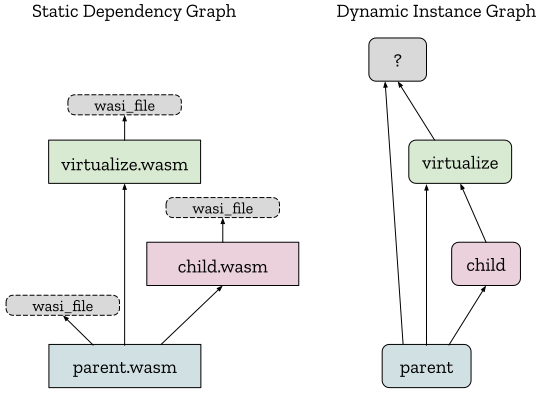
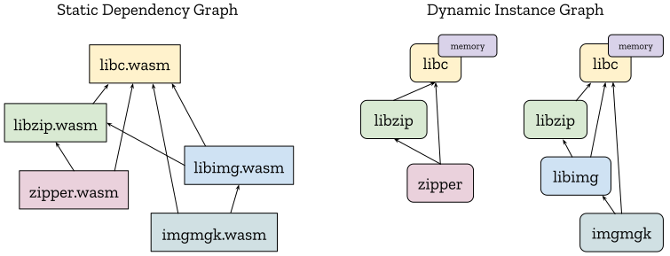

This explainer introduces the Module Linking proposal, which allows WebAssembly
modules to define, import and export modules and instances.

1. [Problem](#problem)
2. [Use Cases](#use-cases)
3. [Additional Requirements](#additional-requirements)
4. [Proposed Additions](#proposed-additions)
   1. [Single-level Imports](#single-level-imports)
   2. [Module and Instance Types](#module-and-instance-types)
   3. [Instance Imports and Aliases](#instance-imports-and-aliases)
   4. [Module Imports and Nested Instances](#module-imports-and-nested-instances)
   5. [Nested Modules](#nested-modules)
   6. [Module and Instance Exports](#module-and-instance-exports)
   7. [Binary Format Considerations](#binary-format-considerations)
   8. [Summary](#summary)
5. [Use Cases Revisited](#use-cases-revisited)
6. [Additional Requirements Revisited](#additional-requirements-revisited)
7. [FAQ](#faq)


## Problem

Currently, WebAssembly modules have no way to define how they are to be
instantiated and linked together without relying on host-specific conventions.
Consequently, the only portable way to link modules today is to [statically link]
them, in a language/toolchain-specific manner which prevents modular code
reuse, leads to code duplication in production and keeps languages separate.
We would like to enable a portable, host- and language-independent ecosystem of
composable WebAssembly modules.


## Use Cases

To motivate the proposed solution, we consider 2 use cases whose requirements
aren't satisfied by simpler solutions. After the proposal is introduced,
the use cases are [revisited](#use-cases-revisited) with worked-out examples
using the proposal.


### Link-time Virtualization

When using a first-class instantiation API like the JS API's [`instantiate`],
the imports of the module-to-be-instantiated appear as explicit arguments
supplied by the caller. This has several useful properties that should be
preserved by a pure-wasm linking solution:

First, it enables applications to easily enforce the [Principle of Least Authority],
passing modules only the imports necessary to do their job. There are currently
[cases][Figma plugins] of Web applications relying on this property to sandbox
untrusted plugins.

Second, it enables client modules to fully or partially [virtualize] the imports
of their dependencies without extraordinary challenge or performance overhead.
For example, if a module imports a set of file operations and a client wants to
reuse this module on a system without builtin file I/O, the client should be
able to virtualize the file operations with an in-memory implementation.
Virtualization also enhances the ability of developers to apply the Principle of
Least Authority, by allowing a client module to not only pass *subsets* of
capabilities, but to also dynamically [attenuate] capabilities. Lastly,
virtualization allows developers to locally test modules intended for later
deployment by [mocking] deployment APIs with local implementations. In general,
if virtualization is well-supported and efficient, software reusability and
composability are increased.

While it is possible to perform virtualization at run-time, e.g., passing
function references for all virtualizable operations, this approach would be
problematic as a basis for a highly-virtualizable ecosystem since it would
require modules to intentionally opt into virtualization by choosing to receive
first-class function references instead of using function imports. In the limit,
to provide maximum flexibility to client code, toolchains would need to avoid
*all* use of imports, effectively annulling a core part of wasm. Because of
their more-static nature, imports are inherently more efficient and optimizable
than first-class function references, so this would also have a negative
performance impact.

Thus, to avoid the problems of run-time virtualization, a wasm linking solution
should enable **link-time virtualization** such that a parent module can
specify all the imports of its dependencies (without any explicit opt-in on the
part of those dependencies), just as with the JS API's [`instantiate`]. Note
that it's possible to achieve run-time virtualization by supplying link-time
function imports that perform dynamic dispatch on their parameters. Link-time
virtualization is thus a fairly general mechanism to enable multiple styles of
virtualization.

As an example, given the static dependency graph on the left (where all 3
modules import `wasi_file`), it should be possible for `parent.wasm` to
generate the linked instance graph on the right:

<p align="center"></p>

Here, `parent.wasm` is creating a virtualized version of its imported `wasi_file`
and then passing this on to the child. Thus, `"wasi_file"` doesn't name a single
global implementation; rather it names an *interface* which can be variously
implemented. Indeed, even `parent.wasm` doesn't know whether it received the
host's native implementation of `wasi_file` or some other implementation
supplied by another module that imports `parent.wasm` (hence the `?` in the
diagram). As mentioned above, there may not even *be* a "native" implementation
of `wasi_file`. Critically, though, it is `parent.wasm` that gets to determine
which `wasi_file` instance `child.wasm` gets to import and `child.wasm` has
no way to circumvent this.


### Shared-Everything Dynamic Linking

"Dynamic Linking" refers to keeping modules separate until load-time so that
common modules can be shared by multiple programs. This avoids the need to
[statically link]  (i.e., duplicate) the shared modules into each program.
"Shared-Everything" linking refers to the case where the linked modules share
memory and tables and is distinguished from the [Shared-Nothing Linking] case
enabled by [Interface Types]. Shared-everything dynamic linking in wasm
effectively emulates [native dynamic linking], which has the same goals.

Modules are dynamically linked by creating module [instances][Semantic Phases]
that can call each others' functions, either directly through calls to function
imports or indirectly through `call_indirect`. One challenge unique to
shared-everything dynamic linking is controlling exactly which module instances
share memory. A design where sharing code equates to sharing memory may seem
natural, but this sacrifices isolation. Lack of isolation can lead to difficult
bugs that only appear when independent programs are composed. Lack of isolation
also enables new kinds of supply-chain attacks. Ideally, to maximize isolation,
each "program" (for some definition of "program" defined by the toolchain)
should be able to generate a fresh memory each time the program is run,
regardless of which of its modules are shared with other programs.

For example, it should be possible to take the static dependency graph of the
application on the left, which contains two programs (`zipper` and `imgmgk`) and
three shared modules (`libc`, `libzip` and `libimg`), and create the
dynamically-linked instance graph on the right at application runtime.

<p align="center"></p>

Moreover, the linking mechanism must allow the developers of each individual
module, program and application to independently deal with the inevitable
version changes (major and minor) of their dependencies.


## Additional Requirements

In addition to being able to satisfy the above use cases, there are two more
general requirements to be considered:

* **No GC dependency**: Since we wish to use this feature to implement dynamic
  linking of C/C++/Rust programs, and since C/C++/Rust programs aim to run on
  hosts that don't contain a GC, this proposal should not require a general
  garbage collection algorithm to implement; reference-counting should suffice.

* **Enable AOT compilation**: Today, using static linking of libraries, wasm
  hosts are able to use a simple, Ahead-of-Time compilation model to generate
  high-performance machine code images that can be immediately instantiated and
  run. Switching to dynamic linking should not hurt hosts' ability to perform
  the same degree of optimization.

This proposal is checked against these requirements [below](#additional-requirements-revisited).


## Proposed Additions

The central idea of this proposal is to allow a client module to import its
dependencies as *modules*. In contrast, today, modules can only import the
exports of *already-created instances*. Importing dependencies as modules allows
clients to control how the dependencies are instantiated (supplying the imports)
and linked (exposing the exports) which in turn enables the advanced use cases
mentioned above. In addition to the central addition of module imports, several
other complementary additions are proposed to finish the picture. The complete
list is summarized [at the end](#summary).


### Single-level Imports

An additional form of import is added which has only one import string instead
of the usual two:
```wasm
(module
  (import "a" "b" (func))  ;; legal today
  (import "x" (func))      ;; illegal today, legalized with this proposal
)
```

In general, this addition removes a long-standing source of awkwardness on the
Web: when [ESM-integration] isn't used, the first ("module") name string is
usually unnecessary leading tools to unnecessarily invent ad hoc module names
like `env`.

Single-level imports have a backwards-compatible interpretation on the Web. For
the [JS API], the following JS snippet would instantiate the above module:
```js
const importObj = {
  a: {
    b: () => {}
  }
  x: () => {}
};
WebAssembly.instantiate(module, importObj);
```
For [ESM-integration], single-level imports could potentially map to the ESM
[default export].


### Module and Instance Types

The wasm spec currently [classifies modules with a type][Module Validation],
specifically a function type mapping imports to exports. However, to describe a
full module interface, the names of imports and exports must be known as well.
Thus, this proposal enriches the existing **module type** by adding names
to imports and exports.

Thus far, module types only appear as an internal detail of the wasm spec; they
aren't explicitly represented in the text format. This proposal additionally
gives module types a text format parse rule.

The module type text format is derived from the existing module definition text
format (extended with single-level imports) by simply dropping all internal
details. This is symmetric to how function types are derived from function
definitions by dropping function bodies. For example, this module:
```wasm
(module
  (memory (import "a") 1 2)
  (func (import "b") (param i32))
  (table (export "c") 1 funcref)
  (func $notImportedOrExported (result i64)
    i64.const 0
  )
  (func (export "d") (result f32)
    f32.const 0
  )
)
```
has a module type:
```wasm
(module
  (memory (import "a") 1 2)
  (func (import "b") (param i32))
  (table (export "c") 1 funcref)
  (func (export "d") (result f32))
)
```
Just as with module definitions, the above module type is actually an
[abbreviation][import-abbrev] in the text format for:
```wasm
(module
  (import "a" (memory 1 2))
  (import "b" (func (param i32)))
  (export "c" (table 1 funcref))
  (export "d" (func (result f32)))
)
```
which is primarily used in this proposal.

Although module types list imports and exports in a particular order, module
*subtyping* allows a supplied module definition's to have a different order as
long as all the fields are present. Moreover, module subtyping is covariant in
exports and contravariant in imports (including allowing a subtype to have more
exports and fewer imports than its supertype). These permissive subtyping rules
provide modules additional flexibility to evolve without breaking existing
clients. Since module types are checked at instantiation-time, this extra
flexibility shouldn't affect runtime performance.

In WebAssembly there is also the separate concept of a module *instance*,
which is the result of [instantiating][Module Instantiation] a module with
imports. An instance type is mostly just the module type with the imports removed
(with the only future complication being [Type Imports] used in export
signatures). For example, the above module, when instantiated, would have
instance type:
```wasm
(instance
  (export "c" (table 1 funcref))
  (export "d" (func (result f32)))
)
```
Like module types, the exports of an instance type are ordered, but instance
subtyping allows arbitrary reordering and compatible extension.

Just like function types, module and instance types can either be written
"inline" or factored out into an explicit type definition that can be reused via
`$identifier`. (Also, just like function types, the inline form is an
[abbreviation][typeuse-abbrev] for an implicit type definition and use.) For
example, an instance type can be defined:
```wasm
(type $WasiFile (instance
  (export "read" (func (param i32 i32 i32) (result i32)))
  (export "write" (func (param i32 i32 i32) (result i32)))
))
```

In many examples shown below, type definitions are needed for *both* a module
type and the instance type produced when that module type is instantiated. In
such cases, to avoid duplicating all the exports, a new "zero-level export"
`(export $InstanceType)` form is added which injects all the exports of
`$InstanceType` into the containing module type. For example, here is the type
of a module which implements the above-defined `$WasiFile` interface via Win32
operations:
```wasm
(module
  (import "Win32" "ReadFile" (func (param i32 i32 i32 i32) (result i32)))
  (import "Win32" "WriteFile" (func (param i32 i32 i32 i32) (result i32)))
  (export $WasiFile)
)
```

Lastly, just as the current [text format conventions recommend `.wat`][WAT] as
the extension of a file that contains a module definition, this proposal
includes a new recommendation for text files containing a bare module or
instance type be suffixed `.wit`. `.wit` files can be used as part of the
toolchain ecosystem for describing a module's interface without including its
definition. For example, this can be used to generate compatible source-language
declarations. Like `.wat` files, `.wit` files are not consumed directly by the
host.

Module and Instance types can also be used to describe the types of imports:


### Instance Imports and Aliases

Just as a function, memory, table or global can be imported by specifying a
function, memory, table or global type, instances can be imported by specifying
an instance type:
```wasm
(module
  (import "i" (instance $i
    (export "f1" (func $f1))
    (export "f2" (func $f2 (param i32)))
  ))
)
```
This module imports an instance that exports two functions, `f1` and `f2`.

Since instances have no observable identity (a [`moduleinst`] is just an
immutable record containing the addresses of its fields in the store) there
should be no semantic difference between the previous module and this next one:
```wasm
(module
  (import "i" "f1" (func $f1))
  (import "i" "f2" (func $f2 (param i32)))
)
```

To achieve this in a (binary and text) backwards-compatible way, multi-level
imports are recast as syntactic sugar for single-level imports of instances.
(In pathological cases of interleaving between two module strings, the
text/binary rules would specify that the aggregate instance import would
appear at the position of the first of its fields.) Thus, the above two modules
both parse and decode to the same abstract syntax.

From inside a module definition, the exports of an imported instance can be
accessed with an identifier path:
```wasm
(module
  (import "i" (instance $i
    (export "f1" (func $f1))
    (export "f2" (func $f2 (param i32)))
  ))
  (func (export "run")
    call $i.$f1
  )
)
```
Identifier paths like `$i.$f1` are actually syntactic sugar for creating
a new kind of definition added by this proposal called an `alias`. A desugared
version of the same module can be written:
```wasm
(module
  (import "i" (instance $i
    (export "f1" (func $f1))
    (export "f2" (func $f2 (param i32)))
  ))
  (alias $i.$f1 (instance $i) (func $f1))
  (func (export "run")
    call $i.$f1
  )
)
```
`alias` definitions allow a module to inject definitions from other places into
its own index spaces. In this case, the `alias` injects the `f1` export
of `i` into the module's function index space. Repeated uses of the same
`$i.$f1` path would reuse the same alias. Thus, path desugaring is symmetric to
how multiple uses of inline function types [desugar][typeuse-abbrev] to the same
function type definition.

Aliases are not restricted to functions: all exportable definitions can be
aliased. One situation where an explicit `alias` definition may be required is
for a default memory or table since if there is no explicit `$i.$j` path used
by instructions to refer to defaults, they must be explicitly aliased:
```wasm
(module
  (import "libc" (instance $libc
    (export "memory" (memory $mem 1))
    (export "table" (table $tbl 0 funcref))
  ))
  (alias (instance $libc) (memory $mem)) ;; memory index 0 = default memory
  (alias (instance $libc) (table $tbl)) ;; table index 0 = default table
  (func
    ...
    i32.load  ;; accesses $libc.$mem
    ...
    table.get ;; accesses $libc.$tbl
    ...
  )
)
```

The benefit of instance imports is that they allow potentially-large groups of
fields to be passed around as a single unit, which can be useful when linking
significant dependencies. Also, practically, instance imports allow import
strings to be factored in the text and binary formats, reducing duplication.


### Module Imports and Nested Instances

A module can similarly be imported by declaring the expected module type. Unlike
instance imports, once a module is imported, it must be instantiated by the
client before it can be executed. This is achieved by creating *nested
instances* via `instance` definitions. For example, in this code:
```wasm
(module
  (import "M" (module $M
    (import "in" (func))
    (export "out" (func $out))
  ))
  (import "f" (func $f))
  (instance $i (instantiate $M (func $f)))
  (func (export "run")
    call $i.$out
  )
)
```
the outer module imports a module `$M` and a function `$f` and then uses `$f` to
instantiate `$M` producing an instance `$i`. `instance` definitions have the form:
```
instance-def  ::= (instance <id>? <instance-init>)
instance-init ::= (instantiate <moduleidx> <instance-arg>*)
instance-arg  ::= (func <funcidx>)
                | (memory <memidx>)
                | (table <tableidx>)
                | (global <globalidx>)
                | (instance <instanceidx>)
                | (module <moduleidx>)
```
where `<instanceidx>` and `<moduleidx>` are indices into the new module
and instance [index spaces] created by module/instance imports/definitions. In
the future, new productions could be added to `<instance-init>` allowing
alternatives to `instantiate` for creating instances, such as directly from
fields without an intermediate module.

Validation requires that the sequence of `import-arg`s match the declared
import args of `<moduleidx>` based on the order of imports in `<moduleidx>`'s
module type definition. As mentioned in [Module and Instance Types](#module-and-instance-types),
module subtyping (checked at instantiation time for `$M`) allows the actual
imported module to have compatible imports and exports in any order. Thus,
`instance` statements do not impose any ordering requirements on the actual
imported modules.

Instances can also be supplied as arguments to `instantiate`, allowing whole
collections of fields to be passed as a single unit. For example, this module
imports a `wasi_file` instance and passes it on to the child:
```wasm
(module
  (type $WasiFile (instance
    (export "read" (func (param i32 i32 i32) (result i32)))
    (export "write" (func (param i32 i32 i32) (result i32)))
    ...
  ))
  (import "wasi_file" (instance $wasi-file (type $WasiFile)))
  (import "child" (module $CHILD
    (import "wasi_file" (instance (type $WasiFile)))
  ))
  (instance (instantiate $CHILD (instance $wasi-file)))
)
```

In general, the arguments of `instantiate` can refer to any preceding type,
import, module, instance or alias definition. This includes all imports and
the local definitions that precede the `instantiate` in module order. For
example, the following module (with desugared aliases) validates:
```wasm
(module
  (import "a" (instance $a (export "f" (func $f))))
  (import "B" (module $B (import "f" (func)) (export "g" (func $g))))
  (alias $a.f (func $a $f))
  (instance $b1 (instantiate $B (func $a.f)))
  (alias $b1.g (func $b1 $g))
  (instance $b2 (instantiate $B (func $b1.g)))
)
```
Notably, `instantiate` cannot refer to any local function, memory, table or
global definitions. The reason for this is that, when instantiating a module
`M`, the nested instances of `M` are created before the [`moduleinst`] of `M`
itself and, thus, local function, memory, table and global definitions do not
exist when the nested instances are created. Thus, for example, the following
module wouldn't validate.
```wasm
(module
  (import "A" (module $A (import "f" (func))))
  (func $f)
  (instance $a (instantiate $A (func $f))) ;; error, $f not visible to instantiate
)
```
From the perspective of a WebAssembly [Embedding], this proposal changes
[`module_instantiate`]`(M)` from always creating a single `moduleinst` to
instead creating a DAG of `moduleinst`s, with `M`'s `moduleinst` as the returned
root.


### Nested Modules

Symmetric to nested instances, modules can contain *nested modules* via
`module` definitions. Nested modules are injected into the same module index
space as module imports and thus can be instantiated the same way. For example:
```wasm
(module
  (module $CHILD
    (func $hi (export "hi")
      ...
    )
  )
  (instance $child (instantiate $CHILD))
  (func (export "run")
    call $child.$hi
  )
)
```

Unlike most source-language nested functions/classes, nested modules have no
special access to their parents' state. However, since modules and types are
closed, stateless expressions which would otherwise be duplicated, sharing is
allowed between children and parents via module and type aliases.

For convenience in the text format, a module can directly use the identifier of
an enclosing module's type or module definitions:
```wasm
(module
  (type $WasiFile (instance $wasi-file
    (export "read" (func (param i32 i32 i32) (result i32)))
  ))
  (module $child
    (import "wasi_file" (instance (type $WasiFile)))
  )
)
```
This gets desugared into an explicit `alias` definition adding an entry to
the child's type index space:
```wasm
(module
  (type $WasiFile (instance $wasi-file
    (export "read" (func (param i32 i32 i32) (result i32)))
  ))
  (module $child
    (alias $WasiFile parent (type $WasiFile))
    (import "wasi_file" (instance (type $WasiFile)))
  )
)
```
Note that `parent` aliases can only refer to previously-defined items relative
to the module's own declaration in the module index space. This means that it
can refer to previously defined imports, modules, instances, or aliases, but it
cannot refer to imports (for example) that occur after the module's
declaration. A module is declared with its type and defined later in the binary
format.

In general, language-independent tools can easily merge multiple `.wasm` files
in a dependency graph into one `.wasm` file by performing simple transformations
that do not require relocations or other fixup-enabling metadata. The reverse
transformation is also possible and producer-toolchain-independent: a nested
module of a `.wasm` file can be split out into a new `.wasm` file by duplicating
aliased definitions. Thus, nested modules can be a useful tool for packaging and
bundling tools.

In the future, nested modules may be independently useful for [feature testing]
or supplying first-class module references (via `ref.module $module-index`) to
run-time instantiation APIs.


### Module and Instance Exports

Lastly, symmetric to all other kinds of definitions, modules and instances can
be exported. For example:
```wasm
(module
  (import "a" (module $a ...))
  (module $b ...)
  (import "c" (instance $c ...))
  (instance $d ...)

  (export "e1" (module $a))
  (export "e2" (module $b))
  (export "e3" (instance $c))
  (export "e4" (instance $d))
)
```
Therefore, module and instance types can appear in both the imports and exports
of module types and instance types.

Symmetric to the "zero-level export" mentioned [above](#module-and-instance-types)
which is allowed in module *types*, zero-level exports are also allowed in
module *definitions* as a convenient way to define a module's exports to be
that of a given instance.

For example, this (outer) module:
```wasm
(module
  (module $M (func (export "foo") ..))
  (instance $i (instantiate $M))
  (export $i)
)
```
exports the function `foo`. If `$i` were instead exported with a normal
single-level export, the outer module would instead export an *instance* (which
itself exported `foo`).


### Binary Format Considerations

This proposal defines four new [sections] in the binary format:
* **Module Section**: declares a list of module types of modules defined in
  the ModuleCode Section. Like the Function Section, the Module Section is
  present near the beginning of a module to allow the creation of an immutable
  compilation environment for the code that follows.
* **ModuleCode Section**: contains a list of module definitions, encoded using
  the same [`module` binary format production] that decodes top-level modules
  (making `module` a recursive production). Like the Code Section, present at
  the end of a module, to allow parallel streaming compilation.
* **Instance Section**: contains a list of `instance` definitions, currently
  all defined via `instantiate`.
* **Alias Section**: contains a list of `alias` definitions, both to enclosing
  modules' module and type definitions, and to preceding instance definitions'
  exports.

The tricky thing about aliases are that they need to both *refer to* and be
*referred to by* instance definitions. Moreover, once the [Type Imports]
proposal is incorporated, instances will contain type exports which type and
module definitions will need to reference. Keeping all the sections monolithic
would therefore necessarily create cycles between them, which wasm has thus far
avoided by design. To prevent illegal cycles, validation would need to implement
a cycle-checking algorithm.

To avoid this complexity, this proposal instead loosens the section ordering
rules such that the 5 initial sections (Type, Import, Module, Instance, Alias)
can appear in any order, any number of times each. When a section is present
multiple times, its definitions are concatenated. When validating a definition
in one of these sections, the validation [index spaces] are defined to only
contain the definitions up to that point. Thus, a validation algorithm can
represent each index space with a vector that is appended to as each section
is validated with vector bounds checking ensuring acyclicy.

To ease implementation and preserve the property that imports always occupy
the first indices of an index space, one constraint is placed on the initial
section ordering: all Import Sections must precede all Module and Instance
Sections.

The ModuleCode Section is placed right before the Code Section. This ensures
that ModuleCode can be stream-compiled just like the Code Section given the
immutable compilation environment created by the preceding sections. The
ModuleCode Section precedes the Code Section so that the bytestream order
mirrors instantiation order which may allow better parallelization under some
execution strategies.

As an example, the text module:
```wasm
(module
  (import "a" (instance $a (export "f" (func $f))))
  (module $M
    (import "f" (func))
    (export "g" (func $g)))
  (instance $m1 (instantiate $M (func $a.$f)))
  (instance $m2 (instantiate $M (func $m1.$g)))
  (func $x (call $m2.$g))
)
```
could be encoded with the binary section sequence:
1. Type Section, defining an instance type (for `$a`), module type (for `$M`)
   and function type (for `$x`)
2. Import Section, defining the import `$a`, referencing (1)
3. Module Section, declaring `$M` in the module index space, referencing (1)
4. Alias Section, injecting `$a.$f` into the function index space, referencing (2)
5. Instance Section, defining the instance `$m1`, referencing (3) and (4)
6. Alias Section, injecting `$m1.$g` into the function index space, referencing (5)
7. Instance Section, defining the instance `$m2`, referencing (3) and (6)
8. Alias Section, injecting `$m2.$g` into the function index space, referencing (7)
9. Function Section, declaring `$x` in the function index space, referencing (1)
10. ModuleCode Section, defining `$M`
11. Code Section, defining `$x`

This repository also contains an [initial proposal for the binary format
updates](./Binary.md).


### Summary

To summarize the proposed changes (all changes in both text and binary format):
* The `module` field of [`import`] becomes optional (allowing single-level
  imports). (How to encode this in the [Import Section] is an interesting
  question.)
* New `module` and `instance` type constructors are added that may be used to
  define types in the [type section].
* New `module` and `instance` cases are added to [`importdesc`], referencing
  module and instance type definitions in the type section.
* A new Module Section is added which contains a sequence of module type
  declarations for module definitions in the ModuleCode Section.
* A new ModuleCode Section is added which contains module definitions, encoded
  using the same binary format as top-level modules.
* A new Instance Section is added which contains a sequence of instance
  definitions.
* A new Alias Section is added which contains a sequence of alias definitions.
* New `module` and `instance` cases are added to [`exportdesc`] and the export
  string becomes optional (allowing zero-level exports).


## Use Cases Revisited

Worked examples of the [above use cases](#use-cases) are given in separate docs:
* [Link-Time Virtualization](Example-LinkTimeVirtualization.md)
* [Shared-Everything Dynamic Linking](Example-SharedEverythingDynamicLinking.md)

## Additional Requirements Revisited

Reconsidering the requirements stated [above](#additional-requirements):
* **No GC dependency**: The instances that can be created by this proposal are
  all necessarily kept alive by a parent instance. Thus, insofar as a host
  is able to avoid GC in the status quo (without nested instances), a host can
  continue to avoid the need for GC. Technically, a host could obtain a
  reference to a nested instance, drop all references to its parent instances,
  and thus be able to collect the unreachable parent instances as garbage.
  However, this would only be an optional optimization and should never be
  required for correct execution because there is a bounded amount of garbage
  created. Moreover, hosts could continue to manage the lifetime of instances by
  treating [stores] as the atomic unit of lifetime.
* **Enable AOT compilation**: Nested instance definitions are declarative
  enough to allow an AOT compiler to trivially connect exports to imports
  to the same degree as a static linker, assuming it knows the resolution
  of all module imports. In fact, when all module imports are known, a simple,
  language-agnostic tool can transpile a `.wasm` module using the features
  of this proposal into a `.wasm` module using only [multi-memory].


## FAQ

### How does this relate to ESM-integration?

The Module Linking proposal extends the behavior of [`module_instantiate`]`(M, args)`
to potentially instantiate a small, encapsulated DAG of instances rooted at
`M`'s instance, with `M` being in charge of distributing `args` to its children
in the DAG. The [ESM-integration] spec determines when to call
`module_instantiate(M, args)`, and for which modules `M` and which values
`args`. Thus, the two proposals are naturally complementary:
* ESM-integration defines how a root wasm module imports host dependencies
  (where every module in the ESM [module map] is considered a host dependency).
* The Module Linking proposal defines how a wasm module can privately
  instantiate its dependencies in a way that encapsulates state while sharing
  code.

With this division of labor, a root wasm module `M` loaded via ESM-integration
can import all of its dependencies as *module imports*, using ESM-integration
to fetch and cache the modules while still allowing `M` to completely control
the instantiation and linking steps.

In particular, ESM-integration would be extended to support this proposal so
that, when a module `M` is loaded by ESM-integration, for single-level module
imports:
* the module import's string is [resolved] to a URL and fetched as usual
* the response's `Content-Type` must be `application/wasm`
* the fetched wasm module's imports are *not* recursively fetched as usual
* the fetched wasm module is validated and decoded into a [`module`] which is:
  * supplied as an arg to `module_instantiate(M, args)`
  * stored in the [module map] for future sharing with other module imports

More generally, when ESM-integration loads a module with a
[single-level imports](#single-level-imports):
* If the import is of module type, it is fetched as described above.
* If the import is of instance type, it is treated the same way as a two-level
  import is today, with the imported instance type's exports serving as the
  second level.
* Any other type of import is treated as a regular import of the
  [default export].

With this extension, a single JS app will be able to load multiple wasm
programs using ESM `import` statements and have these programs safely and
transparently share library code as described in
[shared-everything dynamic linking example](Example-SharedEverythingDynamicLinking.md).


[Statically link]: https://en.wikipedia.org/wiki/Static_library
[Native Dynamic Linking]: https://en.wikipedia.org/wiki/Dynamic_loading
[Principle of Least Authority]: https://en.wikipedia.org/wiki/Principle_of_least_privilege
[Virtualize]: https://en.wikipedia.org/wiki/Virtualization
[Mocking]: https://en.wikipedia.org/wiki/Mock_object
[De Bruijn Index]: https://en.wikipedia.org/wiki/De_Bruijn_index

[Semantic Phases]: https://webassembly.github.io/spec/core/intro/overview.html#semantic-phases
[JS API]: https://webassembly.github.io/spec/js-api/index.html
[`instantiate`]: https://webassembly.github.io/spec/js-api/index.html#dom-webassembly-instantiate-moduleobject-importobject
[Module Validation]: https://webassembly.github.io/spec/core/valid/modules.html#valid-module
[import-abbrev]: https://webassembly.github.io/spec/core/text/modules.html#id1
[typeuse-abbrev]: https://webassembly.github.io/spec/core/text/modules.html#abbreviations
[Module Instantiation]: https://webassembly.github.io/spec/core/exec/modules.html#instantiation
[WAT]: https://webassembly.github.io/spec/core/text/conventions.html#conventions
[Indices]: https://webassembly.github.io/spec/core/syntax/modules.html#indices
[Index Spaces]: https://webassembly.github.io/spec/core/syntax/modules.html#indices
[Sections]: https://webassembly.github.io/spec/core/binary/modules.html#sections
[Type Section]: https://webassembly.github.io/spec/core/binary/modules.html#binary-typesec
[Import Section]: https://webassembly.github.io/spec/core/binary/modules.html#binary-importsec
[Embedding]: https://webassembly.github.io/spec/core/appendix/embedding.html
[`module`]: https://webassembly.github.io/spec/core/syntax/modules.html#syntax-module
[`moduleinst`]: https://webassembly.github.io/spec/core/exec/runtime.html#module-instances
[`module_instantiate`]: https://webassembly.github.io/spec/core/appendix/embedding.html#embed-module-instantiate
[`import`]: https://webassembly.github.io/spec/core/syntax/modules.html#syntax-import
[`importdesc`]: https://webassembly.github.io/spec/core/syntax/modules.html#syntax-importdesc
[`exportdesc`]: https://webassembly.github.io/spec/core/syntax/modules.html#syntax-exportdesc
[`module` binary format production]: https://webassembly.github.io/spec/core/binary/modules.html#binary-module

[Shared-Nothing Linking]: https://github.com/WebAssembly/interface-types/blob/master/proposals/interface-types/Explainer.md#enabling-shared-nothing-linking-of-webassembly-modules
[Interface Types]: https://github.com/WebAssembly/interface-types/blob/master/proposals/interface-types/Explainer.md
[Type Imports]: https://github.com/WebAssembly/proposal-type-imports/blob/master/proposals/type-imports/Overview.md
[Export Types]: https://github.com/WebAssembly/proposal-type-imports/blob/master/proposals/type-imports/Overview.md#exports
[Multi-Memory]: https://github.com/webassembly/multi-memory
[GC Types]: https://github.com/WebAssembly/gc/blob/master/proposals/gc
[ESM-integration]: https://github.com/WebAssembly/esm-integration
[Function References]: https://github.com/WebAssembly/function-references
[Feature Testing]: https://github.com/WebAssembly/conditional-sections/issues/22

[`dlopen`]: https://pubs.opengroup.org/onlinepubs/009695399/functions/dlopen.html
[`dlsym`]: https://pubs.opengroup.org/onlinepubs/009695399/functions/dlsym.html
[Figma plugins]: https://www.figma.com/blog/an-update-on-plugin-security/
[Attenuate]: http://cap-lore.com/CapTheory/Patterns/Attenuation.html
[Default Export]: https://developer.mozilla.org/en-US/docs/web/javascript/reference/statements/export#Description
[Module Map]: https://html.spec.whatwg.org/multipage/webappapis.html#module-map
[Resolved]: https://html.spec.whatwg.org/multipage/webappapis.html#resolve-a-module-specifier
