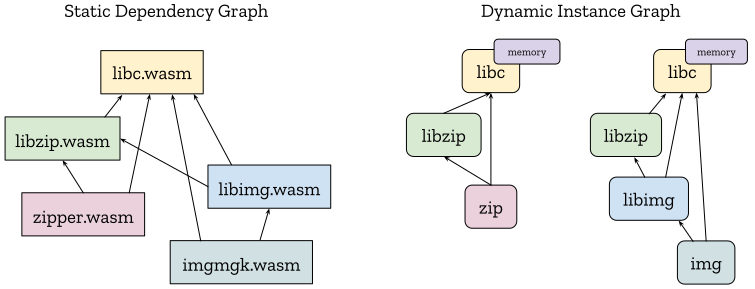

This explainer introduces the Module Imports proposal, which allows WebAssembly
modules to define, import and export modules and instances.

1. [Problem](#problem)
2. [Use Cases](#use-cases)
3. [Additional Requirements](#additional-requirements)
4. [Proposed Additions](#proposed-additions)
   1. [Single-level Imports](#single-level-imports)
   2. [Module and Instance Types](#module-and-instance-types)
   3. [Instance Imports](#instance-imports)
   4. [Module Imports and Nested Instances](#module-imports-and-nested-instances)
   5. [First-class Definition References](#first-class-definition-references)
   6. [Nested Modules](#nested-modules)
   7. [Module and Instance Exports](#module-and-instance-exports)
   8. [Summary](#summary)
5. [Use Cases Revisited](#use-cases-revisited)
6. [Additional Requirements Revisited](#additional-requirements-revisited)
7. [FAQ](#faq)


## Problem

Currently, WebAssembly modules have no way to define how they are to be
instantiated and linked together without relying on host-specific conventions.
Consequently, the only portable way to link modules today is to [statically link]
them, in a language/toolchain-specific manner which prevents modular code
reuse, leads to code duplication in production and keeps languages separate.
We would like to enable a portable, host- and language-independent ecosystem of
composable WebAssembly modules.


## Use Cases

To motivate the proposed solution, we consider 2 use cases whose requirements
aren't satisfied by simpler solutions. After the proposal is introduced,
the use cases are [revisited](#use-cases-revisited) with worked-out examples
using the proposal.


### Link-time Virtualization

When using a first-class instantiation API like the JS API's [`instantiate`],
the imports of the module-to-be-instantiated appear as explicit arguments
supplied by the caller. This has several useful properties that should be
preserved by a pure-wasm linking solution:

First, it enables applications to easily enforce the [Principle of Least Authority],
passing modules only the imports necessary to do their job. There are currently
[cases][Figma plugins] of Web applications relying on this property to sandbox
untrusted plugins.

Second, it enables client modules to fully or partially [virtualize] the imports
of their dependencies without extraordinary challenge or performance overhead.
For example, if a module imports a set of file operations and a client wants to
reuse this module on a system without builtin file I/O, the client should be
able to virtualize the file operations with an in-memory implementation.
Virtualization also enhances the ability of developers to apply the Principle of
Least Authority, by allowing a client module to not only pass *subsets* of
capabilities, but to also dynamically [attenuate] capabilities. Lastly,
virtualization allows developers to locally test modules intended for later
deployment by [mocking] deployment APIs with local implementations. In general,
if virtualization is well-supported and efficient, software reusability and
composability are increased.

While it is possible to perform virtualization at run-time, e.g., passing
function references for all virtualizable operations, this approach would be
problematic as a basis for a highly-virtualizable ecosystem since it would
require modules to intentionally opt into virtualization by choosing to receive
first-class function references instead of using function imports. In the limit,
to provide maximum flexibility to client code, toolchains would need to avoid
*all* use of imports, effectively annulling a core part of wasm. Because of
their more-static nature, imports are inherently more efficient and optimizable
than first-class function references, so this would also have a negative
performance impact.

Thus, to avoid the problems of run-time virtualization, a wasm linking solution
should enable **link-time virtualization** such that a parent module can
specify all the imports of its dependencies (without any explicit opt-in on the
part of those dependencies), just as with the JS API's [`instantiate`]. Note
that it's possible to achieve run-time virtualization by supplying link-time
function imports that perform dynamic dispatch on their parameters. Link-time
virtualization is thus a fairly general mechanism to enable multiple styles of
virtualization.

As an example, given the static dependency graph on the left (where all 3
modules import `wasi_file`), it should be possible for `parent.wasm` to
generate the linked instance graph on the right:

<p align="center"></p>

Here, `parent.wasm` is creating a virtualized version of its imported `wasi_file`
and then passing this on to the child. Thus, `"wasi_file"` doesn't name a single
global implementation; rather it names an *interface* which can be variously
implemented. Indeed, even `parent.wasm` doesn't know whether it received the
host's native implementation of `wasi_file` or some other implementation
supplied by another module that imports `parent.wasm` (hence the `?` in the
diagram). As mentioned above, there may not even *be* a "native" implementation
of `wasi_file`. Crtically, though, it is `parent.wasm` that gets to determine
which `wasi_file` instance `child.wasm` gets to import and `child.wasm` has
no way to circumvent this.


### Shared-Everything Dynamic Linking

"Dynamic Linking" refers to keeping modules separate until load-time so that
common modules can be shared by multiple programs. This avoids the need to
[statically link]  (i.e., duplicate) the shared modules into each program.
"Shared-Everything" linking refers to the case where the linked modules share
memory and tables and is distinguished from the [Shared-Nothing Linking] case
enabled by [Interface Types]. Shared-everything dynamic linking in wasm
effectively emulates [native dynamic linking], which has the same goals.

Modules are dynamically linked by creating module [instances][Semantic Phases]
that can call each others' functions, either directly through calls to function
imports or indirectly through `call_indirect`. One challenge unique to
shared-everything dynamic linking is controlling exactly which module instances
share memory. A design where sharing code equates to sharing memory may seem
natural, but this sacrifices isolation. Lack of isolation can lead to difficult
bugs that only appear when independent programs are composed. Lack of isolation
also enables new kinds of supply-chain attacks. Ideally, to maximize isolation,
each "program" (for some definition of "program" defined by the toolchain)
should be able to generate a fresh memory each time the program is run,
regardless of which of its modules are shared with other programs.

For example, it should be possible to take the static dependency graph of the
application on the left, which contains two programs (`zipper` and `imgmgk`) and
three shared modules (`libc`, `libzip` and `libimg`), and create the
dynamically-linked instance graph on the right at application runtime.

<p align="center"></p>

Moreover, the linking mechanism must allow the developers of each individual
module, program and application to independently deal with the inevitable
version changes (major and minor) of their dependencies.


## Additional Requirements

In addition to being able to satisfy the above use cases, there are two more
general requirements to be considered:

* **No GC dependency**: Since we wish to use this feature to implement dynamic
  linking of C/C++/Rust programs, and since C/C++/Rust programs aim to run on
  hosts that don't contain a GC, this proposal should not require a general
  garbage collection algorithm to implement; reference-counting should suffice.

* **Enable AOT compilation**: Today, using static linking of libraries, wasm
  hosts are able to use a simple, Ahead-of-Time compilation model to generate
  high-performance machine code images that can be immediately instantiated and
  run. Switching to dynamic linking should not hurt hosts' ability to perform
  the same degree of optimization.

This proposal is checked against these requirements [below](#additional-requirements-revisited).


## Proposed Additions

The proposal introduces a set of additions to WebAssembly centered around giving
modules the ability to import modules. Thus, while the proposal is named "Module
Imports", there are actually several other additions. The complete list is
summarized [at the end](#summary).


### Single-level Imports

An additional form of import is added which has only one import string instead
of the usual two:
```wasm
(module
  (import "a" "b" (func))  ;; legal today
  (import "x" (func))      ;; illegal today, legalized with this proposal
)
```

In general, this addition removes a long-standing source of awkwardness on the
Web: when [ESM-integration] isn't used, the first ("module") name string is
usually unnecessary leading tools to unnecessarily invent ad hoc module names
like `env`.

Single-level imports have a backwards-compatible interpretation on the Web. For
the [JS API], the following JS snippet would instantiate the above module:
```js
const importObj = {
  a: {
    b: () => {}
  }
  x: () => {}
};
WebAssembly.instantiate(module, importObj);
```
For [ESM-integration], single-level imports map naturally to the ESM
[default export], closing a current slight expressivity gap.


### Module and Instance Types

The wasm spec currently [classifies modules with a type][Module Validation],
specifically a function type mapping imports to exports. However, to describe a
full module interface, the names of imports and exports must be known as well.
Thus, this proposal enriches the existing **module type** by adding names
to imports and exports.

Thus far, module types only appear as an internal detail of the wasm spec; they
aren't explicitly represented in the text format. This proposal additionally
gives module types a text format parse rule.

The module type text format is derived from the existing module definition text
format (extended with single-level imports) by simply dropping all internal
details. This is symmetric to how function types are derived from function
definitions by dropping function bodies. For example, this module:
```wasm
(module
  (memory (import "a") 1 2)
  (func (import "b") (param i32))
  (table (export "c") 1 funcref)
  (func $notImportedOrExported (result i64)
    i64.const 0
  )
  (func (export "d") (result f32)
    f32.const 0
  )
)
```
has a module type:
```wasm
(module
  (memory (import "a") 1 2)
  (func (import "b") (param i32))
  (table (export "c") 1 funcref)
  (func (export "d") (result f32))
)
```
Just as with module definitions, the above module type is actually an
[abbreviation][import-abbrev] in the text format for:
```wasm
(module
  (import "a" (memory 1 2))
  (import "b" (func (param i32)))
  (export "c" (table 1 funcref))
  (export "d" (func (result f32)))
)
```
which is the form we'll mostly use in this document.

In WebAssembly there is also the separate concept of a module *instance*,
which is the result of [instantiating][Module Instantiation] a module with
imports. An instance type is mostly just the module type with the imports removed
(with the only future complication being [Type Imports] used in export
signatures). For example, the above module, when instantiated, would have
instance type:
```wasm
(instance
  (export "b" (table 1 funcref))
  (export "c" (func (result f32)))
)
```

Just like function types, module and instance types can either be written
"inline" or factored out into an explicit type definition that can be reused via
`$identifier`. (Also, just like function types, the inline form is an
[abbreviation][typeuse-abbrev] for an implicit type definition and use.) For
example, an instance type can be defined:
```wasm
(type $WasiFile (instance
  (export "read" (func (param i32 i32 i32) (result i32)))
  (export "write" (func (param i32 i32 i32) (result i32)))
))
```

In many examples shown below, type definitions are needed for *both* a module
type and the instance type produced when that module type is instantiated. In
such cases, to avoid duplicating all the exports, a new `(exports $instanceType)`
type expression is added which can be used to define module types. For example,
here is the type of a module which implements the above-defined `$WasiFile`
interface via Win32 operations:
```wasm
(module
  (import "Win32" "ReadFile" (func (param i32 i32 i32 i32) (result i32)))
  (import "Win32" "WriteFile" (func (param i32 i32 i32 i32) (result i32)))
  (exports $WasiFile)
)
```

Lastly, just as the current [text format conventions recommend `.wat`][WAT] as
the extension of a file that contains a module definition, this proposal
includes a new recommendation for text files containing a bare module or
instance type be suffixed `.wit`. `.wit` files can be used as part of the
toolchain ecosystem for describing a module's interface without including its
definition. For example, this can be used to generate compatible source-language
declarations.

Module and Instance types can also be used to describe the types of imports:


### Instance Imports

Just as a function, memory, table or global can be imported by specifying a
function, memory, table or global type, modules or instances can be imported
by specifying a module or instance type.

A single instance import is practically equivalent to individually importing
all of its exports. Indeed, instances have no distinct identity: instances are
just [immutable tuples][`moduleinst`] containing the *addresses* of mutable
things with identity (that could be independently imported) like memories and
tables. For example, the instance import in this module:
```wasm
(module
  (import "i" (instance $i
    (export "f1" (func $f1))
    (export "f2" (func $f2 (param i32)))
  ))
  (func (export "run")
    call $i.$f1
  )
)
```
is practically equivalent to individually importing the instance's exports:
```wasm
(module
  (import "i" "f1" (func $f1))
  (import "i" "f2" (func $f2 (param i32)))
  (func (export "run")
    call $f1
  )
)
```
In particular, the exports of an instance import are injected into the
appropriate [index spaces] of the containing instance, allowing them to be
directly accessed by `call`, `i32.load`, `table.get`, etc. The `$i.$f` textual
notation is new, but still encodes in the binary format as a single integer
immediate. The reason for the preceding `$i.` is that a single instance type can
be factored out into a type definition and reused multiple times:
```wasm
(module
  (type $I (instance
    (export "f" (func $f))
    (export "g" (func $g))
  ))
  (import "i1" (instance $i1 (type $I)))
  (import "i2" (instance $i2 (type $I)))
  (func (export "run")
    call $i1.$f
    call $i1.$g
    call $i2.$f
    call $i2.$g
  )
)
```
In the following sections, the utility of instance imports will be more clear as
a concise way to pass around whole instances instead of all their exports
individually. But for now, one immediate benefit of instance imports is that
they allow for module and export names to be maximally factored out for both
text- and binary-format reuse.


### Module Imports and Nested Instances

Symmetric to instances, modules can be imported via module type. Once a module
is imported, it must be instantiated before it can be executed. This is achieved
by creating *nested instances* via `instance` definitions. For example, in this
code:
```wasm
(module
  (import "m" (module $M
    (import "in" (func))
    (export "out" (func $out))
  ))
  (import "f" (func $f))
  (instance $i (instance.instantiate $M (ref.func $f)))
  (func (export "run")
    call $i.$out
  )
)
```
the outer module imports a module `$M` and a function `$f` and then uses `$f` to
instantiate `$m` producing an instance `$i`. `instance` definitions are created
using [constant initializer expression], similar to `global` definitions. The
`instance.instantiate` instruction introduced by this proposal is *only* allowed
in constant initializer expressions, but could in the future be allowed as a
normal instruction to enable runtime instantiation. Its signature is:
```
instance.instantiate $module : [ (ref Tᵢ)ⁿ ] -> [ (ref $InstanceT) ]
```
where
* `$module` refers to a module (in the module index space) of type `$ModuleT`
* the `n` operands `Tᵢ` match the `n` imports of `$ModuleT` in import vector order
* `$InstanceT` is the instance type of `$ModuleT`

Note that while `instance.instantiate` relies on the positional order of imports
in the local type definition of `$ModuleT`, module subtyping is independent of
order (exports are matched by string) and thus reordering the exports of a
module definition will never break clients.

Instance imports and definitions can also be used as operands to
`instance.instantiate`. For example, this module imports a `wasi_file`
instance and passes it on to its child:
```wasm
(module
  (type $WasiFile (instance
    (export "read" (func (param i32 i32 i32) (result i32)))
    (export "write" (func (param i32 i32 i32) (result i32)))
  ))
  (import "wasi_file" (instance $wasi-file (type $WasiFile)))
  (import "child" (module $child
    (import "wasi_file" (instance (type $WasiFile)))
  ))
  (instance (instance.instantiate $child (ref.instance $wasi-file)))
)
```
Here, `ref.instance` is a new instruction symmetric to [`ref.func`], selecting an
instance from the instance index space via a static index immediate. It will be
discussed more in the next section.

`instance.instantiate` allows its operands to be subtypes of the declared
module import types. When the operands are of instance or module type, that
means checking module/instance subtyping. Unlike with [GC types], where
subtyping needs to imply memory layout, module and instance subtyping can be
order-independent, matching up by import/export names instead.

`instance.instantiate` can refer back to all instance imports and all preceding
instance definitions, allowing the creation of arbitrary acyclic graphs of
instances. The nested instances of a module `M` are instantiated during
[`module_instantiate`]`(M)`, before the top-level `M`'s own [`moduleinst`] is
created. Thus, `instance.instantiate` cannot refer to any functions, memories,
tables or global defined by the top-level `M`, since they do not yet exist when
creating nested instances. In general, with this proposal,
`module_instantiate(M)` goes from always creating a single instance to
potentially creating a *DAG* of instances, with `M`'s instance as the root. 


### First-class Definition References

The instruction `ref.instance` used in the previous section has the signature:
```wasm
ref.instance $instance : [] -> [ (ref $InstanceT) ]
```
where `$instance` refers to an instance (in the instance index space) of type
`$InstanceT`. Types of the form `(ref (instance ...))` are a new kind of
*instance reference type*.

The proposal also adds a symmetric instruction for modules:
```wasm
ref.module $module : [] -> [ (ref $ModuleT) ]
```
where `$module` refers to a module (in the module index space) of type
`$ModuleT`. Types of the form `(ref (module ...))` are a new kind of
*module reference type*. (See the
[shared-everything dynamic linking example](Example-SharedEverythingDynamicLinking.md)
to see sample usage.)

Similar to the subtype relationship that exists between typed function
references and `funcref` in the [Function References] proposal, module reference
types share a supertype `moduleref` and instance reference types share a
supertype `instanceref`:
```wasm
(ref (func ...)) <: funcref
(ref (module ...)) <: moduleref
(ref (instance ...)) <: instanceref
```

The previous section noted that `instance.instantiate` is, in this proposal,
only allowed in the constant initializer expressions of `instance` definitions.
The immediate reason for this is the GC requirement stated [above](#additional-requirements):
since instances can form graphs (via mutable tables and globals), a first-class
`instance.instantiate` instruction would inherently require a garbage collection
algorithm to collect dead instances. This could be added later on as part of a
batch of GC features (viz., [GC types]) with a careful definition of what
features are available on hosts that don't support GC. But for now, this proposal
aims to be universally available.

In contrast, `ref.module`/`ref.instance` and module/instance references have no
such inherent GC requirement and would be useful in allowing hosts to optionally
expose runtime instantiation through *import APIs*. For example, using
[Interface Types] to express the signature more succinctly, a classic
[`dlopen`]/[`dlsym`] interface could be approximated:
```wasm
(instance
  (export "dlopen" (func
    (param $module moduleref)
    (param $imports (array (record (field "name" string) (field "value" anyref))))
    (result instanceref)
  ))
  (export "dlsym" (func
    (param $instance instanceref)
    (param $symbol string)
    (result funcref)
  ))
)
```

Thus, as a conservative first step toward runtime dynamic linking, this proposal
includes `ref.module` and `ref.instance` in the general wasm instruction set and
includes module and instance reference types in the general [`reftype`] set.

Lastly, since modules can not just import individual functions, but also individual
memories, tables and globals, new `ref.memory`, `ref.table` and `ref.global`
instructions and reference types are added:
```wasm
ref.memory $memory : [] -> [ (ref (memory ...)) ]
ref.table $table : [] -> [ (ref (table ...)) ]
ref.global $global : [] -> [ (ref (global ...)) ]
```
(These instructions have been planned since the first Reference Types proposal.)


### Nested Modules

Symmetric to nested instances, modules can contain *nested modules* via
`module` definitions. Nested modules are injected into the same module index
space as module imports and thus can be instantiated the same way. For example:
```wasm
(module
  (module $child
    (func $hi (export "hi")
      ...
    )
  )
  (instance $i (instance.instantiate $child))
  (func (export "run")
    call $i.$hi
  )
)
```

Unlike most source-language nested functions/classes, nested modules have no
special access to their parents' state. However, since modules and types are
closed, stateless expressions and thus "sharing" is equivalent to duplication,
nested modules can refer to their parents' types and modules via *aliases*. As
syntactic sugar in the textual format, a nested module can simply use the
`$name` of the enclosing module/type:
```wasm
(module
  (type $WasiFile (instance $wasi-file
    (export "read" (func (param i32 i32 i32) (result i32)))
  ))
  (module $child
    (import "wasi_file" (instance (type $WasiFile)))
  )
)
```
The desugared form of `$child` would explicitly create the alias with a `type`
definition which references the parent:
```wasm
(module $Parent
  (type $WasiFile (instance $wasi-file
    (export "read" (func (param i32 i32 i32) (result i32)))
  ))
  (module $child
    (type $WasiFile (alias $Parent.$WasiFile))
    (import "wasi_file" (instance (type $WasiFile)))
  )
)
```
In the binary format, a type alias could be represented by a [De Bruijn index]
relative to the sequence of parent modules and their respective module/type
index spaces.

Other than type/module sharing, which can easily be undone by duplication, a
module A that imports module B is semantically equivalent to module A nesting
module B. This means tools can merge multiple `.wasm` files into one `.wasm` by
a trivial, language-independent transformation. Thus, module imports and nested
modules can serve as a language-independent basis for first expressing a module
dependency graph and then bundling/linking that dependency graph into a single
`.wasm` module for portable distribution.

Additionally, on the Web and other hosts that provide runtime instantiation
APIs, nested modules allow an outer module to bundle module code that is to be
instantiated dynamically by passing a first-class module reference (created via
`ref.module`) to the runtime instantiation API.


### Module and Instance Exports

Lastly, symmetric to all other kinds of definitions, modules and instances can
be exported. For example:
```wasm
(module
  (import "a" (module $a ...))
  (module $b ...)
  (import "c" (instance $c ...))
  (instance $d ...)

  (export "e1" (module $a))
  (export "e2" (module $b))
  (export "e3" (instance $c))
  (export "e4" (instance $d))
)
```
Therefore, module and instance types can appear in both the imports and exports
of module types and instance types.


### Summary

To summarize the proposed changes (all changes in both text and binary format):
* The `module` field of [`import`] become optional (allowing single-level
  imports). (How to encode this in the [import section] is an interesting
  question.)
* New `module` and `instance` type constructors are added that may be used to
  define types in the [type section].
* A new `alias` case is added to type definitions allowing the import of parent
  modules' type definitions.
* New `module` and `instance` cases are added to [`importdesc`], with the
  type indicated by `typeidx`, like `func`.
* A new `module` section is added which contains a sequence of either module
  definitions or `alias` definitions (of parents' modules). In terms of the
  binary format, a nested module definition has the same binary format as a
  non-nested `.wasm` module. Thus, the [`module`] binary format production
  becomes recursive.
* A new `instance` section is added which contains a sequence of instance
  definitions. Like [`global`] definitions, an `instance` definition contains
  an `instance` type and an `init` expression which is validated to match.
* A new `instance.instantiate` instruction is added which is only allowed in
  `instance` `init` expressions.
* New `ref.instance` and `ref.module` instructions are added to the general
  instruction set.
* New module and instance reference types `(ref (module ...))`, `moduleref`,
  `(ref (instance ..))` and `instanceref` are added to [`reftype`].
* New `module` and `instance` cases are added to [`exportdesc`].


## Use Cases Revisited

Worked examples of the [above use cases](#use-cases) are given in separate docs:
* [Link-Time Virtualization](Example-LinkTimeVirtualization.md)
* [Shared-Everything Dynamic Linking](Example-SharedEverythingDynamicLinking.md)

## Additional Requirements Revisited

Reconsidering the requirements stated [above](#additional-requirements):
* **No GC dependency**: The lifetimes of nested instances are necessarily the
  same as the lifetime of their parent instance. Thus, this proposal introduces
  no new interesting lifetimes compared to the status quo today. Of course, if
  GC is currently needed on a host to collect dead instances (as is the case,
  e.g., on the Web), it will continue to. But if a host currently has
  more-explicitly defined instance lifetimes today, that same scheme will
  continue to work with this proposal.
* **Enable AOT compilation**: Nested instance definitions are declarative
  enough to allow an AOT compiler to trivially connect exports to imports
  to the same degree as a static linker, assuming it knows the resolution
  of all module imports. In fact, when all module imports are known, a simple,
  language-agnostic tool can transpile a `.wasm` module using the features
  of this proposal into a `.wasm` module using only [multi-memory].


## FAQ

### How does this relate to ESM-integration?

The Module Imports proposal extends the behavior of [`module_instantiate`]`(M, args)`
to potentially instantiate a small, encapsulated DAG of instances rooted at
`M`'s instance, with `M` being in charge of distributing `args` to its children
in the DAG. The [ESM-integration] spec determines when to call
`module_instantiate(M, args)`, and for which modules `M` and which values
`args`. Thus, the two proposals are naturally complementary:
* ESM-integration defines how a root wasm module imports host dependencies
  (where every module in the ESM [module map] is considered a host dependency).
* The wasm Module Imports proposal defines how a wasm module can privately
  instantiate its dependencies in a way that encapsulates state while sharing
  code.

The addition of [single-level imports](#single-level-imports) does require a
slight extension to ESM-integration though. For a single-level import:
* If the import is of instance type, it should be treated the same way as a two-level
  import is today, with the imported instance type's exports serving as the
  second level.
* If the import is of module type, then the fetched resource *must* be an actual
  wasm module. This module is not instantiated, but rather cached *as a module*
  in the [module map]. Other module imports of the same URL will thus be able to
  share the (uninstantiated) module code.
* Any other type of import is to be treated as a regular import of the 
  [default export].

With this extension, a single JS app will be able to load multiple wasm
programs using ESM `import` statements and have these programs safely and
transparently share library code as described in 
[shared-everything dynamic linking example](Example-SharedEverythingDynamicLinking.md).


[Statically link]: https://en.wikipedia.org/wiki/Static_library
[Native Dynamic Linking]: https://en.wikipedia.org/wiki/Dynamic_loading
[Principle of Least Authority]: https://en.wikipedia.org/wiki/Principle_of_least_privilege
[Virtualize]: https://en.wikipedia.org/wiki/Virtualization
[Mocking]: https://en.wikipedia.org/wiki/Mock_object
[De Bruijn Index]: https://en.wikipedia.org/wiki/De_Bruijn_index

[Semantic Phases]: https://webassembly.github.io/spec/core/intro/overview.html#semantic-phases
[JS API]: https://webassembly.github.io/spec/js-api/index.html
[`instantiate`]: https://webassembly.github.io/spec/js-api/index.html#dom-webassembly-instantiate-moduleobject-importobject
[`reftype`]: https://webassembly.github.io/reference-types/core/syntax/types.html#syntax-reftype
[Module Validation]: https://webassembly.github.io/spec/core/valid/modules.html#valid-module
[import-abbrev]: https://webassembly.github.io/spec/core/text/modules.html#id1
[typeuse-abbrev]: https://webassembly.github.io/spec/core/text/modules.html#abbreviations
[Module Instantiation]: https://webassembly.github.io/spec/core/exec/modules.html#instantiation
[WAT]: https://webassembly.github.io/spec/core/text/conventions.html#conventions
[Index Spaces]: https://webassembly.github.io/spec/core/syntax/modules.html#indices
[Type Section]: https://webassembly.github.io/spec/core/binary/modules.html#binary-typesec
[Import Section]: https://webassembly.github.io/spec/core/binary/modules.html#binary-importsec
[constant initializer expression]: https://webassembly.github.io/spec/core/syntax/modules.html#syntax-global
[`moduleinst`]: https://webassembly.github.io/spec/core/exec/runtime.html#module-instances
[`module_instantiate`]: https://webassembly.github.io/spec/core/appendix/embedding.html#embed-module-instantiate
[`moduleinst`]: https://webassembly.github.io/spec/core/exec/runtime.html#module-instances
[`import`]: https://webassembly.github.io/spec/core/syntax/modules.html#syntax-import
[`importdesc`]: https://webassembly.github.io/spec/core/syntax/modules.html#syntax-importdesc
[`exportdesc`]: https://webassembly.github.io/spec/core/syntax/modules.html#syntax-exportdesc
[`module`]: https://webassembly.github.io/spec/core/binary/modules.html#binary-module
[`global`]: https://webassembly.github.io/spec/core/syntax/modules.html#syntax-global

[Shared-Nothing Linking]: https://github.com/WebAssembly/interface-types/blob/master/proposals/interface-types/Explainer.md#enabling-shared-nothing-linking-of-webassembly-modules
[Interface Types]: https://github.com/WebAssembly/interface-types/blob/master/proposals/interface-types/Explainer.md
[Type Imports]: https://github.com/WebAssembly/proposal-type-imports/blob/master/proposals/type-imports/Overview.md
[Multi-Memory]: https://github.com/webassembly/multi-memory
[GC Types]: https://github.com/WebAssembly/gc/blob/master/proposals/gc
[ESM-integration]: https://github.com/WebAssembly/esm-integration
[Function References]: https://github.com/WebAssembly/function-references
[`ref.func`]: https://github.com/WebAssembly/function-references/blob/master/proposals/function-references/Overview.md#functions

[`dlopen`]: https://pubs.opengroup.org/onlinepubs/009695399/functions/dlopen.html
[`dlsym`]: https://pubs.opengroup.org/onlinepubs/009695399/functions/dlsym.html
[Figma plugins]: https://www.figma.com/blog/an-update-on-plugin-security/
[Attenuate]: http://cap-lore.com/CapTheory/Patterns/Attenuation.html
[Default Export]: https://developer.mozilla.org/en-US/docs/web/javascript/reference/statements/export#Description
[Module Map]: https://html.spec.whatwg.org/multipage/webappapis.html#module-map
